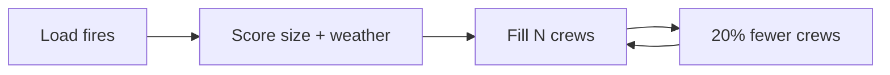

# Case 3 - Which wildfires get the next crew?

**Stream:** Software and Computational Math  
**Event:** IEEE YP Industry Hackathon  
**Dates:** October 2–4, 2026 | Collision Space, Hunter Hub, University of Calgary

---

## The problem (in plain words)

Alberta does not have infinite crews or air tankers. If you always send the next crew to the **biggest** fire, a smaller fire that is spreading fast in wind can wait. That trade-off was expensive in 2023–2025: the Jasper fire was about **$1.1 billion** in insured losses, and 2025 fires shut in about **7% of Canadian oil** at the peak.

This is a **ranking** problem. You are not simulating fire spread.

**Your challenge:** Rank fires for a limited number of crews. Beat “largest area first.” Then cut crews by **20%** and rebuild the list. Report which fires lost a crew.

You ranked fires. You did **not** put the fire out.

---

## Who would use this

An Alberta Wildfire duty officer. You are selling the **next-crew list** when capacity drops, with a reason you can say out loud.

---

## Steps

1. Load the 2023–2025 fire table. Drop rows missing size or coordinates. Say how many.
2. Score each fire in one line (example: size × wind × dryness, or size + spread rate).
3. Give `N` crews (starter: 40). Baseline = largest size first.
4. Set `N` to 80%. Which fire numbers dropped?
5. Duty-officer paragraph: why these fires, what you skipped.

---

## Picture of the loop



A **hectare** is 10,000 m² - a bit larger than a soccer pitch.

---

## New words

| Word | Meaning |
|---|---|
| Size class | Alberta’s letter for how big the fire is (A small → E very large) |
| Spread rate | How fast the fire is growing |
| Baseline | Biggest fire first |

---

## Watch or read (optional)

- [Alberta wildfire status](https://www.alberta.ca/wildfire-status)
- [How wildfires grow (simple overview, U.S. National Weather Service)](https://www.weather.gov/safety/wildfire)
- Open data used here: Alberta historical wildfire CSV (see [`data/README.md`](data/README.md))

---

## Start here

1. Open a terminal **in this folder**.
2. `pip install -r requirements.txt`
3. `python agent_starter.py`
4. Change `N` or the score formula and run it again.

Data notes: [`data/README.md`](data/README.md). **Python 3.10+** (3.11 is best).

## Community proximity map

This standalone app shows the nearest five Alberta communities to one wildfire.
It does not run or change the wildfire model, score hazards, or provide response advice.
The assessment-date selector currently supports **2024-07-16 only**. The main
ranking source is `outputs/dev_recent/ranking_2024.csv`, loaded without running or
modifying the model. Its original `rank`, `rf_probability`, and `baseline_rank`
values are preserved; ranks are not recalculated for the day.

Ranking rows are joined to the existing official local file
`data/raw/fp-historical-wildfire-data-2006-2025.csv` using
`fire_id == str(YEAR) + ":" + FIRE_NUMBER.strip()`. Coordinates come exclusively
from that official file. A ranking `assessment_date` column is used when present;
otherwise the date is derived from official `ASSESSMENT_DATETIME`. Only July 16
records are shown. No fire-start-date fallback is used. The bundled subset is no
longer used for this UI. Both input files are required locally and remain excluded
from Git; the app performs no wildfire-data download. Their modification times
invalidate the data cache.

The daily ranking table shows 49 matching fires with the current inputs. Select a
fire from the dropdown to view a grouped detail card and its community-proximity
map/table/JSON. The overview shows all valid locations without community lines.
Missing fields display `N/A`; missing/invalid coordinates keep the fire in the
ranking table and card but disable its maps/proximity lookup. Unmatched IDs and
invalid assessment dates are reported; ambiguous duplicate IDs produce an error.

Frontend records use an explicit allowlist of ranking, initial-assessment, weather,
fire-characteristic, date, and coordinate fields. `status` is included only when
present in the ranking source. `y`, `CURRENT_SIZE`, and unlisted future-outcome
fields are removed before caching or displaying records. The app shows inputs and
ranking values without causal explanations. Map marker scores use the existing
`rf_probability` value unchanged.

From this folder, using a working Python 3.10+ installation:

```powershell
$mapEnv = Join-Path $env:LOCALAPPDATA 'wildfire-map-venv'
python -m venv $mapEnv
& "$mapEnv\Scripts\python.exe" -m pip install -r requirements.txt
& "$mapEnv\Scripts\python.exe" -m streamlit run streamlit_app.py
```

Open the local URL printed by Streamlit. Select a day and wildfire, inspect
the map and table, and download the result JSON. `Refresh community data` retries
failed requests and clears the one-hour successful-data cache. Internet access is
required for the Alberta API and OpenStreetMap tiles. Partial lookups are explicitly
marked incomplete; complete failure still displays the fire marker.
The environment is deliberately placed outside the deeply nested repository path
to avoid Windows native-library path-length errors. If your existing `.venv` points
to an unavailable Python installation, use the fresh environment above.

Community geometries come exclusively from the [Alberta Government municipal
communities service](https://geospatial.alberta.ca/titan/rest/services/boundaries/municipal_communities_public/MapServer).
Layers 0–6 are queried through `/{layer}/query` with `where=1=1`, selected name/ID/type
fields, `outSR=4326`, `returnGeometry=true`, and `f=geojson`. Metadata supplies field
names; records are paginated in object-ID order. Layer 7 is excluded to avoid
duplicating hamlets. No community coordinates are hardcoded as fallback data.

Point communities use Haversine distance with Earth radius 6371.0088 km. Municipal
polygons use zero distance inside/on the area, otherwise the minimum spherical
distance to boundary segments (minor great-circle arcs, including hole boundaries).
These are straight-line distances, not travel distances. Polygon markers use an
interior representative point; connecting lines terminate at the closest boundary
point. JSON community coordinates are marker positions, not distance endpoints.
Ranking uses full precision and stable tie breakers; displayed distances use two
decimal places. Current municipal geometry is used even for historical fires.

Modules: `app/community_service.py` handles retrieval/normalization, `app/geo.py`
handles distances/results, and `app/map_view.py` creates the map.

Run the offline test suite:

```powershell
& "$mapEnv\Scripts\python.exe" -m unittest discover -s tests -v
```

For a live smoke check, launch the app with the default sample, confirm five rows
and corresponding proximity map features, plus 49 fire records and overview markers.
Confirm the assessment-date selector has only July 16, change the wildfire selector,
inspect its detail card, and test `Refresh community data`. Offline tests cover the
ID join, date filter, field allowlist, missing values/coordinates, selection, geometry,
pagination, empty layers, and partial/network failures. A local-input test checks the
49 real records and unchanged ranks.
