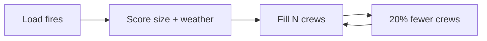

# Case 3 - Which wildfires get the next crew?

**Stream:** Software and Computational Math  
**Event:** IEEE YP Industry Hackathon  
**Dates:** October 2–4, 2026 | Collision Space, Hunter Hub, University of Calgary

---

## The problem (in plain words)

Alberta does not have infinite crews or air tankers. If you always send the next crew to the **biggest** fire, a smaller fire that is spreading fast in wind can wait. That trade-off was expensive in 2023–2025: the Jasper fire was about **$1.1 billion** in insured losses, and 2025 fires shut in about **7% of Canadian oil** at the peak.

This is a **ranking** problem. You are not simulating fire spread.

**Your challenge:** Rank fires for a limited number of crews. Beat “largest area first.” Then cut crews by **20%** and rebuild the list. Report which fires lost a crew.

You ranked fires. You did **not** put the fire out.

---

## Who would use this

An Alberta Wildfire duty officer. You are selling the **next-crew list** when capacity drops, with a reason you can say out loud.

---

## Steps

1. Load the 2023–2025 fire table. Drop rows missing size or coordinates. Say how many.
2. Score each fire in one line (example: size × wind × dryness, or size + spread rate).
3. Give `N` crews (starter: 40). Baseline = largest size first.
4. Set `N` to 80%. Which fire numbers dropped?
5. Duty-officer paragraph: why these fires, what you skipped.

---

## Picture of the loop



A **hectare** is 10,000 m² - a bit larger than a soccer pitch.

---

## New words

| Word | Meaning |
|---|---|
| Size class | Alberta’s letter for how big the fire is (A small → E very large) |
| Spread rate | How fast the fire is growing |
| Baseline | Biggest fire first |

---

## Watch or read (optional)

- [Alberta wildfire status](https://www.alberta.ca/wildfire-status)
- [How wildfires grow (simple overview, U.S. National Weather Service)](https://www.weather.gov/safety/wildfire)
- Open data used here: Alberta historical wildfire CSV (see [`data/README.md`](data/README.md))

---

## Start here

1. Open a terminal **in this folder**.
2. `pip install -r requirements.txt`
3. `python agent_starter.py`
4. Change `N` or the score formula and run it again.

Data notes: [`data/README.md`](data/README.md). **Python 3.10+** (3.11 is best).

## Community proximity map

The Streamlit app runs a configurable RF assessment and displays its fresh daily
ranking, allocation status, maps, and community proximity. A compact form provides
training start/end years, test year, assessment date, and available crew count.
Defaults are training **2022–2023**, test **2024**, date **2024-07-16**, and **10 crews**.
Training years range from 2006–2023; test years range from 2007–2024. Training must
end before the test year and the assessment date must be within that year. Reserved
final-evaluation year 2025 is excluded.

Click **Run assessment** to invoke `model/train_rf.py` with `sys.executable` and
absolute paths resolved from the app file, using the repository as working directory.
A spinner covers model execution. Results use stable run name `outputs/ui_demo`;
the UI immediately loads `allocation_<assessment-date>.csv` without a data cache.
Daily RF rank, probability, baseline rank, and status are displayed unchanged.
Process failures show an error and expandable diagnostics. Missing or malformed
output cannot fall back to an earlier CSV: this run's allocation, metrics, and annual
ranking files are removed before execution.

Initial rendering waits for an assessment. Completed sanitized results and submitted
settings remain in browser session state, so wildfire selection, maps, and downloads
do not retrain the model. Another assessment refreshes results even for the same day.
RF model and scoring logic are unchanged.

Ranking rows are joined to the existing official local file
`data/raw/fp-historical-wildfire-data-2006-2025.csv` using
`fire_id == str(YEAR) + ":" + FIRE_NUMBER.strip()`. Coordinates come exclusively
from that official file. A ranking `assessment_date` column is used when present;
otherwise the date is derived from official `ASSESSMENT_DATETIME`. Only records for the completed assessment date are shown. No fire-start-date fallback is used. The bundled subset is no
longer used for this UI. The official data file is required locally and remains excluded from Git; the app
performs no wildfire-data download. Model outputs are loaded fresh after execution.

The default daily assessment contains 49 fires with the current local inputs. Select a
fire from the dropdown to view a grouped detail card and its community-proximity
map/table/JSON. The overview shows all valid locations without community lines.
Missing fields display `N/A`; missing/invalid coordinates keep the fire in the
ranking table and card but disable its maps/proximity lookup. Unmatched IDs and
invalid assessment dates are reported; ambiguous duplicate IDs produce an error.

### Crew-cut review candidates

This section is a deterministic shortlist for later review, not a new ranking or
allocation. Context comes from the completed run's `outputs/ui_demo/allocation_<date>.csv`
(only fire ID, daily rank, and status) and `metrics.json` (only allocation date,
`H`, and `H_cut`). Annual RF ranks for the existing agent review are joined from
that run's `ranking_<test-year>.csv`; the main table displays daily RF ranks.

Select daily rank `H_cut` as `last_kept`, ranks `H_cut+1` and `H_cut+2` as
`cutoff_boundary`, and the two closest fires whose saved status is `displaced`
or `no_crew` as `proximity_exception`. Only finite, nonnegative distances qualify
for proximity selection; ties sort by fire ID. Deduplicate IDs and keep every
applicable reason. Display last kept first, then boundary fires by daily rank,
then remaining proximity exceptions by distance. Fewer eligible fires produce
a shorter shortlist. Missing community data leaves boundary candidates available.

Allocation context must match the displayed fire IDs completely, with unique
consecutive daily ranks, consistent saved statuses, and valid crew counts/date.
Missing or inconsistent context hides the shortlist with a warning while retaining
the fire UI. Source modification times are included in the review fingerprint; loaded context
is retained with the completed assessment.
Community refresh recomputes candidate selection. `app/review_service.py` handles
loading/selection without mutating source records. No LLM, rescoring, crew swaps,
or allocation changes are performed; outcome fields are excluded.

Frontend records use an explicit allowlist of ranking, initial-assessment, weather,
fire-characteristic, date, and coordinate fields. `status` is included only when
present in the ranking source. `y`, `CURRENT_SIZE`, and unlisted future-outcome
fields are removed before caching or displaying records. The app shows inputs and
ranking values without causal explanations. Map marker scores use the existing
`rf_probability` value unchanged.

From this folder, using a working Python 3.10+ installation:

```powershell
$mapEnv = Join-Path $env:LOCALAPPDATA 'wildfire-map-venv'
python -m venv $mapEnv
& "$mapEnv\Scripts\python.exe" -m pip install -r requirements.txt
& "$mapEnv\Scripts\python.exe" -m streamlit run streamlit_app.py
```

Open the local URL printed by Streamlit. Choose settings, click Run assessment, select a wildfire, inspect
the map and table, and download the result JSON. `Refresh community data` retries
failed requests and clears the one-hour successful-data cache. Internet access is
required for the Alberta API and OpenStreetMap tiles. Partial lookups are explicitly
marked incomplete; complete failure still displays the fire marker.
The environment is deliberately placed outside the deeply nested repository path
to avoid Windows native-library path-length errors. If your existing `.venv` points
to an unavailable Python installation, use the fresh environment above.

Community geometries come exclusively from the [Alberta Government municipal
communities service](https://geospatial.alberta.ca/titan/rest/services/boundaries/municipal_communities_public/MapServer).
This UI queries **layer 0 only: Hamlet, Locality, Townsite**, using `/0/query` with
`where=1=1`, selected name/ID/type fields, `outSR=4326`, `returnGeometry=true`, and
`f=geojson`. Metadata supplies field names; records are paginated in object-ID order.
Only named, finite, in-range Point geometries are accepted. There are no hardcoded
fallback community coordinates. Cities and towns available as municipal polygons
are excluded from this point dataset; "nearest community" means nearest within
this layer's coverage. The reusable API fetcher still supports its original layer
selection for other callers.

Every displayed fire receives `nearest_community`, `nearest_community_distance_km`,
and `community_proximity_rank`. Haversine distance uses Earth radius 6371.0088 km,
using official fire coordinates and the API's actual community point coordinates.
The minimum unrounded distance determines the nearest point; community ties sort
by name, then source ID. Separate sequential proximity ranks sort by unrounded
distance, then fire ID. RF ranks, probabilities, and table order are unchanged.
This is not travel distance, exposure scoring, or a combined ranking.

The daily table compares distances/ranks, and the selected-fire card includes all
three fields. The selected-fire map uses the same points and shows its nearest five
with point-to-point lines, without municipal boundaries or centroid approximations.
Distances display to two decimal places; frontend records retain full precision.
Missing/invalid fire coordinates, unavailable data, or an empty usable point dataset
produce `None` in proximity fields and `N/A` in the UI; no proximity rank is assigned.
Invalid community rows are ignored. Refresh recalculates all fire enrichment and
selected-fire results against the refreshed points. Current point data is used for
historical fires. The original polygon-distance helper remains available for other
callers, but this UI does not use it.

Modules: `app/community_service.py` handles retrieval/normalization, `app/geo.py`
handles distances/results, `app/proximity_service.py` enriches ranked fires, and `app/map_view.py` creates the map.

Run the offline test suite:

```powershell
& "$mapEnv\Scripts\python.exe" -m unittest discover -s tests -v
```

For a live smoke check, run the default assessment, confirm 49 daily fire records
and overview markers, change the wildfire selector, and test Refresh community data.
Rerun the same date with a different crew count and confirm fresh allocation statuses.
Offline tests cover subprocess arguments/failures, fresh result loading, controls,
session persistence, combined review triggering, ID/date joins, field allowlisting,
missing coordinates, geometry, pagination, and partial/network failures.
Point-enrichment tests cover known distances,
invalid coordinates, deterministic ties, separate proximity ranks, and refresh.

### Bounded AI boundary review

The optional agent review uses OpenAI Chat Completions with strict JSON Schema,
default model `gpt-4.1-mini` (`OPENAI_MODEL` can override it). It uses the existing
`requests` dependency. Configure `OPENAI_API_KEY` in the environment that launches
Streamlit, then restart the server. The app also automatically loads the project-root
`.env` using `python-dotenv`; existing process variables take precedence. Install
updated requirements before restarting. Put `OPENAI_API_KEY` and optionally
`OPENAI_MODEL=gpt-4.1-mini` in that local file. `.env` and `.env.*` are Git-ignored;
keys stay server-side and are never included in prompts, UI tables or trace downloads.
Do not commit credentials or paste them into chat.
For a session-only PowerShell setup without putting the key in command history:

```powershell
$reviewSecret = Read-Host 'OpenAI API key' -AsSecureString
$env:OPENAI_API_KEY = [System.Net.NetworkCredential]::new('', $reviewSecret).Password
Remove-Variable reviewSecret
& "$mapEnv\Scripts\python.exe" -m streamlit run streamlit_app.py
```

**Run assessment** triggers the existing boundary review once after each successful
model run and fresh result loading, including repeated runs for the same day or
changed crew counts. Each assessment gets a unique run ID. The agent trace must
match that run ID and the fingerprint of submitted settings and sanitized input
before it can be displayed. Ordinary UI reruns do not repeat model or API calls.

Review sends one request with a 10-second connection timeout and 60-second read
timeout, no tools, and no automatic retries. Its input includes assessment date,
available crews `H`, reduced crews `H_cut`, the complete current daily model ranking,
allocation statuses, and allowlisted fire features. Annual ranks and the boundary
shortlist are retained separately. In `current_model_ranking`, `rank` is daily RF
rank and `annual_rank` is annual RF rank; in boundary records, `rank` remains annual
RF rank and `allocation_rank` is daily RF rank. Coordinates and arbitrary source
columns are excluded, including `y`, `CURRENT_SIZE`, and future outcomes.

The exact response keys remain `decision`, `promote_fire_id`, `displace_fire_id`,
`reason`, and `evidence`. `KEEP_ORIGINAL` requires null IDs and is displayed as
**KEEP**. A validated `SWAP` is displayed as **RERANK**: it may promote only one
shortlisted `displaced`/`no_crew` fire and displace only the last-kept fire. The full
ranking supplies context, not permission for broader reranking. The existing prompt
prefers keeping RF allocation when evidence is ambiguous; proximity alone is
insufficient, and no numeric thresholds or causal RF explanations are invented.

The UI shows the current model ranking, recommendation, concise reasoning/evidence,
and a complete proposed daily ranking. KEEP copies the model order; RERANK exchanges
only the promoted and displaced fires' daily positions. Proposed ranks are separate
from model ranks and saved statuses. A RERANK proposal shows the promotion/displacement and **Pending human review**.
The human chooses **Accept agent reranking** or **Keep model ranking**. Acceptance
revalidates the stored response against the current records and crew context, then
stores a separate final ranking containing only the validated boundary swap and
shows **Agent proposal accepted**. Keeping the model stores its original order and
shows **Original model ranking retained**. Both buttons lock after the choice until
reassessment. Before a choice, no final ranking is stored. Agent KEEP shows **No
reranking proposed**, retains model order as the final ranking, and has no decision
buttons. Final rank is shown separately from original RF ranks and saved statuses.
Neither the agent nor these human actions rewrite the model-generated CSV, model
records, RF ranks, or saved allocation statuses.

Missing credentials, API failures, refusals, incomplete responses, and invalid
proposals retain fresh model results and show an unavailable review status without
claiming KEEP. Empty assessments or no eligible boundary swaps produce an explicitly
labeled deterministic KEEP with a reason, without calling the agent API. Excess
crew capacity is valid: the original kept count is `min(H_cut, number_of_fires)`.

Human decision and final ranking are session-only and bound to the assessment run
ID and proposal fingerprint. Starting another reassessment clears the previous
proposal, human decision, and final ranking before model execution, even if the new
run fails. Community Refresh, unavailable context, or a changed run/fingerprint
also clears human state without automatically calling the agent again; use Run
assessment to reassess. Failed acceptance validation leaves review pending with no
final ranking. Editing
unsubmitted controls does not change completed results.

`Download agent review trace` preserves run identity, submitted settings, sanitized
input, policy/version, model, raw structured response, validation result, normalized
KEEP/RERANK recommendation, proposed ranking, human decision, and final ranking. No API keys or headers are included.
Trace/session state lasts only for the browser session unless downloaded.
`app/agent_review.py` isolates the existing API flow; `app/agent_validation.py`
validates and constructs copied proposals; `app/agent_view.py` displays the assessment.
Offline tests cover crew-count changes, identical repeated assessments, run matching,
KEEP/RERANK proposals, unchanged model data, failures, empty/excess-capacity cases,
community refresh, human acceptance/rejection, decision locking, and CSV preservation. API calls are mocked; a live
agent decision requires a configured key and is not inferred from test responses.
